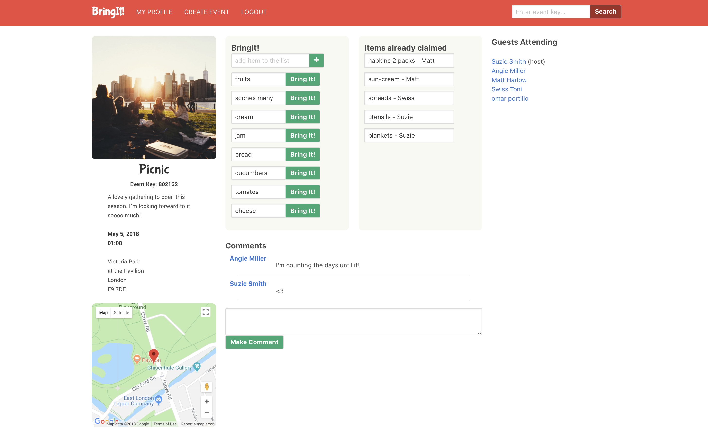
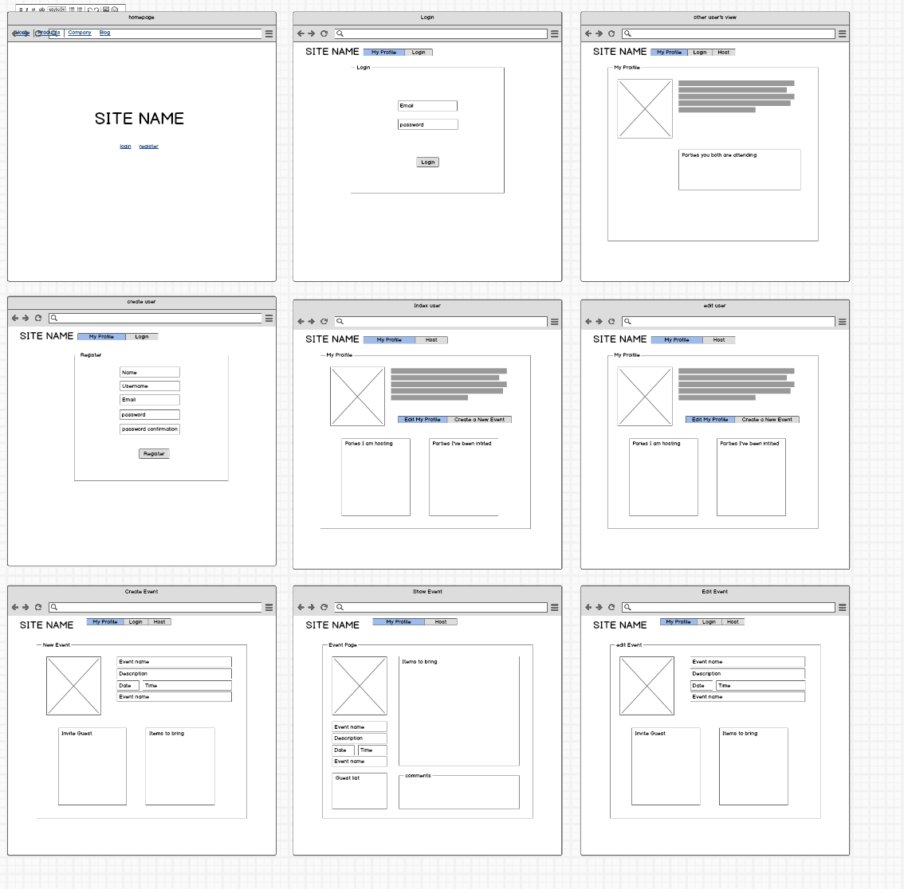
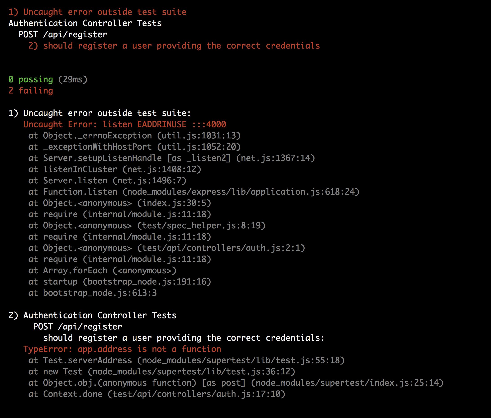
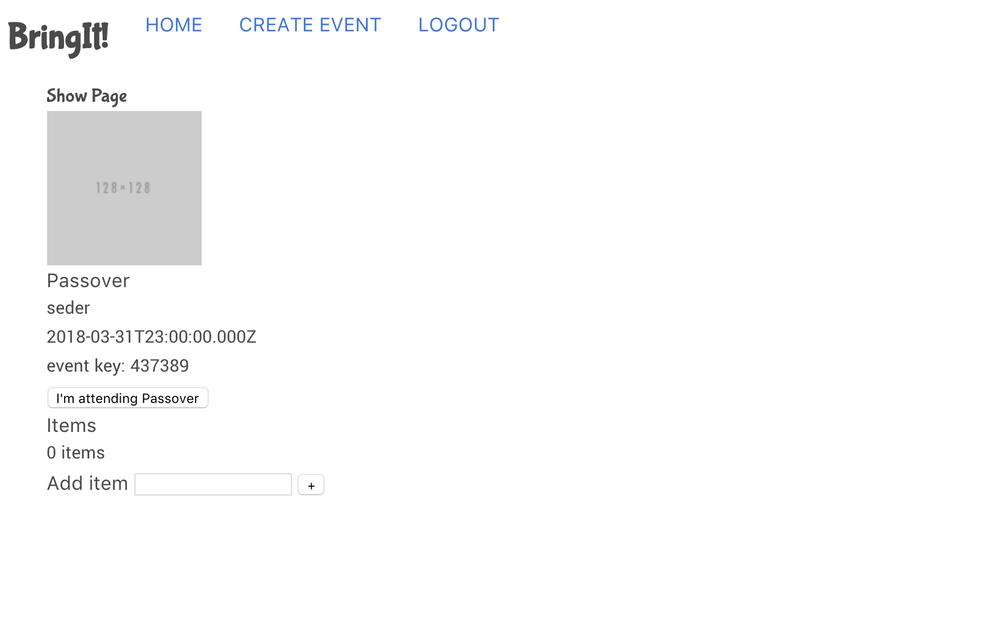

## Bring It!

<figure>
  
  <figcaption>This was a group project, and third project for us, at GA:  Our group was composed of Krisztina Sztupakne Molnar, William Graham and Omar Portillo". It is an organizer of items for your guest to bring to your planed potluck, bbq, party, event...
  </figcaption>
</figure>

### Project Brief

Your app must:

* **Use Mongo, Express and Node** to build an API and a **Angular front-end app** that consumes it
* **Create an API using at least 2 related models**, one of which should be a user
* Include **all major CRUD functions** in a **RESTful API** for at least one of those model
* **API must include tests for the authentication and resful routes
* **Consume your own API** by making your front-end app with **Angular** using some 3rd party dependencies such as **ui.router** and **ng-resource**
* **Add authentication to your API** to restrict access to appropriate users
* **Craft thoughtful user stories together**, as a team
* **Manage team contributions and collaboration** using a standard Git flow on Github
* Layout and style your front-end with **clean & well-formatted CSS**
* **Deploy your application online** so it's publically accessible
* A **working API, built by the whole team**, hosted somewhere on the internet
* A Anguar front-end **that consumes your own API**, hosted somewhere on the internet
* A **link to your hosted working app** in the URL section of your Github repo
* A **team git repository hosted on Github**, with a link to your hosted project, and frequent commits from _every_ team member dating back to the _very beginning_ of the project
* **A ``readme.md`` file**

### Installation and setup

#### Run Locally
- Download or clone the [Github repo](https://github.com/weresquirrel/WDI-third-PROJECT)
- Run `gulp` in the terminal to compile the source code and open in the browser

#### View Online
- [View on Heroku](https://bringit204.herokuapp.com/)
- [View on Github](https://github.com/weresquirrel/WDI-GROUP-PROJECT)

### Approach Taken

1. Reviewed the project brief
2. Brain stormed themed for an app
3. Worked on the wireframe.
4. Worked on the file structure.
5. Worked on the RESTful routes.
6. Worked on the API
7. Added styling using scss
8. Had UX feedback.
9. looped again and again.

<figure>
  
  <figcaption>Wireframe using Balsamiq</figcaption>
</figure>

### Technologies Used

### Dependencies
- angular filePicker
- bcrypt
- bluebird
- body-parser
- express
- express-flash
- express-session
- jsonwebtoken
- method-override
- mongoose
- morgan

###Others

- HTML5
- SCSS
- bulma
- Javascript (ECMAScript 6)
- jQuery
- Git
- Github
- Heroku
- Atom
- GIMP
- GULP
- https://balsamiq.com/
- https://trello.com/
- https://fonts.google.com/
- https://uigradients.com/
- https://coolors.co/
- https://logomakr.com/
- http://fontawesome.io/
- https://unsplash.com/

### Challenges Faced

- Drying up the code
- Matching heroku to present as our localhost is.
- Coding the search functionality.
- Implementing geocoding.
- Coding the tests.

<figure>
  
  <figcaption>Getting Errors on our Code</figcaption>
</figure>

### Where next?

How can the app be extended and improved:

- making some of the schema's editable:
 * currently can't update profile information
 * currenlty can't delete events or profile

- add modals:
 * like when an event is made

- have a album for the event:
  * guest to add pictures to an event.

- Improving the code:
  * I am certain that there are areas of my code to be more efficient and dryer.
  * the code could be refactored further.

- Improve user experience:
  * Futher improve how information is presented in order to have a better user experience.
  * Friend people

- Utilize more APIs:
  * Use and API to shop for items guest are bringing

## Acknowledgments
* Would like to thank my instructors at GA, and classmates.
* Thanks to Robert, Brian and Josh for their ux feedback.
* Thanks to our partners for their ongoing support.
* Thanks to our friends that continue to encourage and support us.

<figure>
  
  <figcaption>An early template</figcaption>
</figure>
